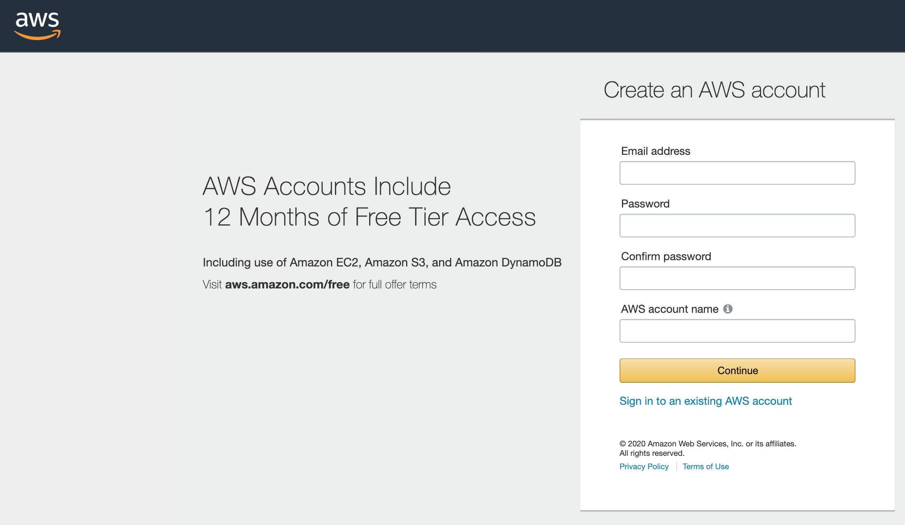

Terraform is a tool for building, changing, and versioning infrastructure safely and efficiently. 

Basically put Terraform is an IAAC that allows you to manage your whole cloud infrastructure as a code, with the ability to document and roll back in case of any error. In the past managing infrastructure was tedious and nerve-wracking, Engineers would log in to the cloud provider portal, review changes, implement changes, document changes on a piece of paper and hope it does not break anything at all. 

Imagine having to make changes to over 10 or 200 cloud services, this would take months to make a simple change or just adding a security policy to a group of resources. You can argue that why not use shell script but If you’ve ever had to maintain someone else’s repository of ad hoc scripts, you know that it almost always devolves into a mess of unmaintainable spaghetti code. 

Ad hoc scripts are great for small  tasks, but if you’re going to be managing all of your infra as code, then you should use an IAC tool that is purpose-built for the job.

Terraform makes managing and maintaining your infrastructure so easy that I can bet you’d know how to use it when you are done with this post.

Let’s get started.

Download terraform from https://www.terraform.io/downloads.html,  and follow instructions to install it or just run as an executable.

We’d be using AWS for this so be sure you have an AWS account by signing up for it here  https://portal.aws.amazon.com/billing/signup. 

 Once signed in go to the IAM section, click on your username, security credential tab, create an access key, once you have your access key.

There are better ways to authenticate terraform instead of hardcoding access keys but for the sake of simplicity let us add the secret key and access key. 

Create a new file called Provider.tf 


# Configure the AWS Provider
provider "aws" {
  version = "~> 2.0"
  region  = "us-east-1"
  access_key = "my-access-key"
  secret_key = "my-secret-key"

}



Create another file ec2.tf



data "aws_ami" "ubuntu" {
  most_recent = true

  filter {
    name   = "name"
    values = ["ubuntu/images/hvm-ssd/ubuntu-trusty-14.04-amd64-server-*"]
  }

  filter {
    name   = "virtualization-type"
    values = ["hvm"]
  }

  owners = ["099720109477"] # Canonical
}

resource "aws_instance" "web" {
  ami           = "${data.aws_ami.ubuntu.id}"
  instance_type = "t2.micro"

  tags = {
    Name = "HelloWorld"
  }
}


Run 

terraform init
terraform plan
terraform apply


In the next post, I’d go into more details on how to set up the ec2 instance with ssh keys, Security group, user data(Install a web  server ) 

[olufuwatayo]: https://twitter.com/olufuwatayo
[Linkedin]:   https://www.linkedin.com/in/professionaldevopsengineer/
